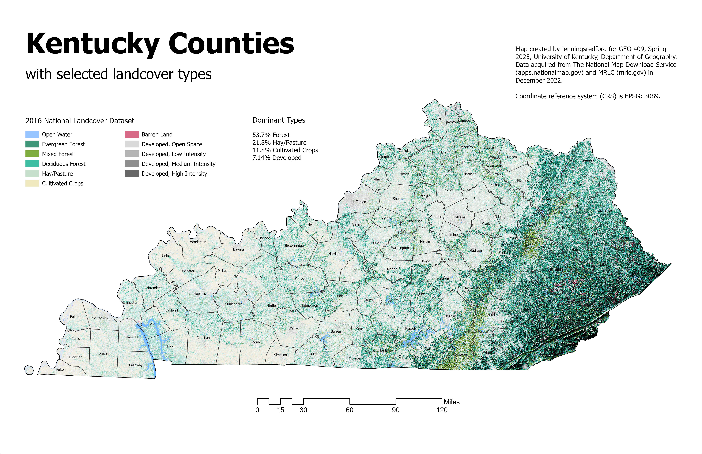
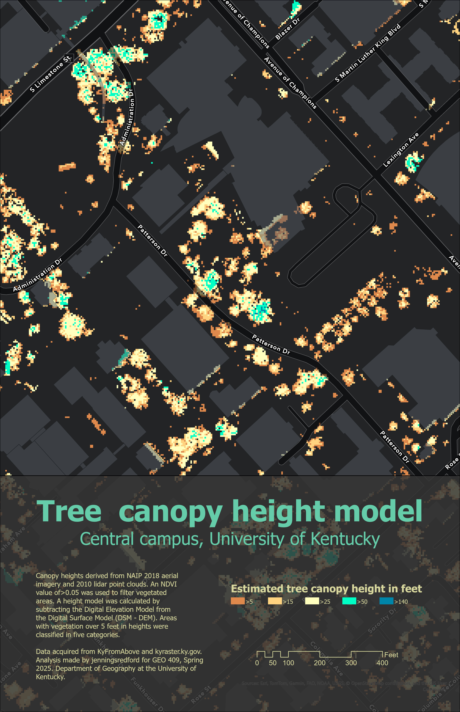

# GEO409 Field Trip Maps
 

Maps for field trip to measure tree canopy (Lab 04 Deliverables):

  
Kentucky counties with selected land cover types – [Download geospatial PDF](KY-landcover.pdf)

  
UKY central campus tree canopy model – [Download geospatial PDF](Tree-canopy-height-model.pdf)

Maps created by jenningsredford for GEO409, Spring 2025, University of Kentucky Department of Geography
